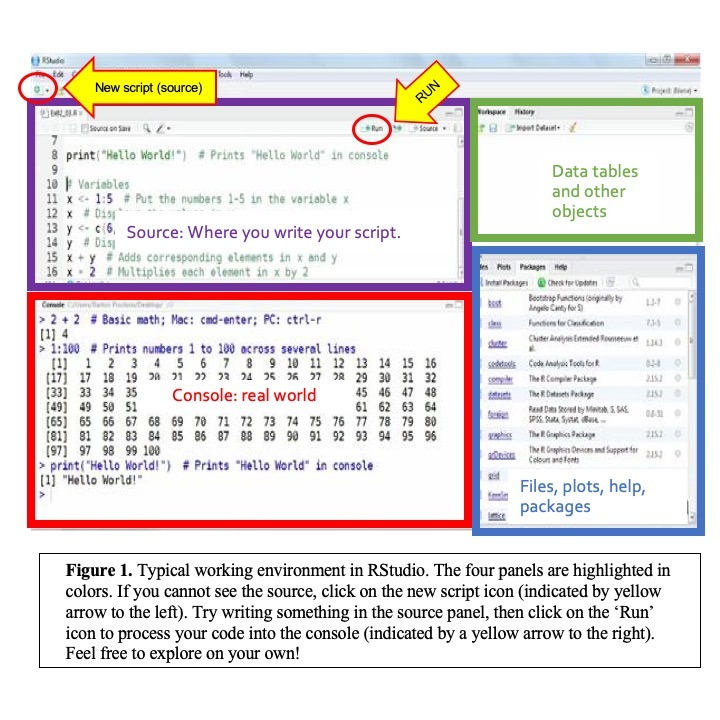

# Simple species mapping with R

## What is R?

R is a coding language with free distribution, designed to perform statistical analyses. R has a basic library of functions (addition / substraction), but an array of packages are available to perform a wide range of functions, including map making.

### Why using R

Because R is code-based, "scripts" (lines of of code to perform analyses) can easily be saved and rerun. For example, if you add data to a dataset, you can rerun your script and obtain an updated answer.

## Accesing R

### on HSU virtual labs:
Although you can download in your personal computer (and you are encouraged to do so – find instructions on Canvas), we will work on a standardized set up on the school virtual lab (vlabs). To access vlabs:
* [Click Here] (https://vlab.humbold.edu)
* Access ‘vLab- Fall 2020’ or 'Desktops'
* Log in with your HSU information
* Go to the search icon to the bottom left and search : ‘Rstudio’
* Open R studio

### Setting up r in your computer
 
R is free, go to (https://www.r-project.org/) click on [download R] and select the link to [Oregon State University], which is the closest to California. Follow the steps and open R.

You can download Rstudio here (https://www.rstudio.com/)

### Some R resources
[Useful R Reference Cheatsheet by Tom Short](https://cran.r-project.org/doc/contrib/Short-refcard.pdf)
[Basic skills by Quick R](https://www.statmethods.net)
[Advanced skills Cheatsheet by Arianne Colton and Sean Chen](https://rstudio.com/wp-content/uploads/2016/02/advancedR.pdf)
[Other resources from YaRrr! The pirate’s guide to R](https://bookdown.org/ndphillips/YaRrr/r-resources.html)

## Tips to learn to code
* PRACTICE! A good practice consists on writing code. Do not copy and paste, do not assume that you got it by reading the tutorial: type it yourself.
* A better practice is to make sure you understand what each line of code is doing. Run line by line when you are following a tutorial
* Heavily annotate your code. Use # to annotate your code (see below to find out what that means).

## What does it look like and what does it all mean
 
 
Figure 1 is a typical workspace in Rstudio, with four panels. You may have to open a new script (source) when you open the program for the first time: click on the new script icon to the top-left corner (see Fig 1, indicated with a yellow arrow). The most important panels right now are on the left, the source and the console. The source code in the top-left corner is where you will type your code and save your script. The console is where the code runs. You can write code directly to the console to find whether it works or not, or the answer to a calculation. You can also send your code from the source to the console to run. Importantly, you will be saving your source code, if you are typing in the console, you will be unable to save your progress or reuse your code. Therefore, I recommend you ALWAYS type and work on the source panel and send your code to run and see the output on the console. The panels on the right will display your data tables, plots, help and other features, but we will get to those later.

